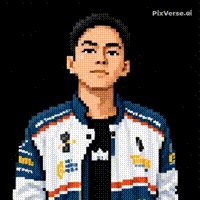

ffmpeg -i ngantuk.mp4 -vf "fps=10,scale=460:-1" avatar.gif



<div align="center">
  
</div>

<br>


<h2 align="center">🌐 Connect With Me</h2>

<p align="center">
  <a href="https://instagram.com/teditenaro" target="_blank">
    
  </a>
  <a href="https://linkedin.com/in/tedi-tenaro" target="_blank">
    
  </a>
  <a href="https://tiktok.com/@teditenaro" target="_blank">
    
  </a>
  <a href="mailto:teditenaro@gmail.com" target="_blank">
    
  </a>
</p>


<br>

<h2 align="center">👾 About Me</h2>

```yaml
focus     : Cybersecurity & Web Development
learning  : Ethical Hacking - Penetration Testing - Web Security
reading   : Books Enthusiast
```


<br>

<h2 align="center">🛠️ Tech Stack & Tools</h2>

<br>

<details open>
<summary><b>💻 Languages</b></summary>
<br>


</details>

<details open>
<summary><b>🌐 Web Development</b></summary>
<br>


</details>

<details open>
<summary><b>🗄️ Database</b></summary>
<br>


</details>

<details open>
<summary><b>🔐 Security Tools</b></summary>
<br>


</details>

<details open>
<summary><b>⚙️ Tools & Platforms</b></summary>
<br>


</details>

<details open>
<summary><b>🖥️ Operating Systems</b></summary>
<br>


</details>

<br>


<h2 align="center">📊 GitHub Statistics</h2>

<div align="center">
  
  
</div>

<div align="center">
  
  
</div>

<div align="center">
  
</div>

<br>


<div align="center">

`^^`
</div>

<div align="center">
  
</div>

<div align="center">
  
</div>
